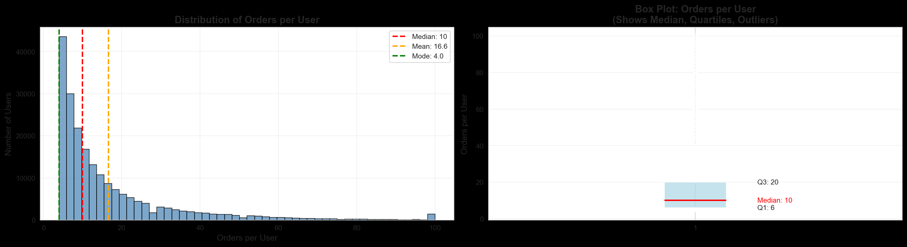
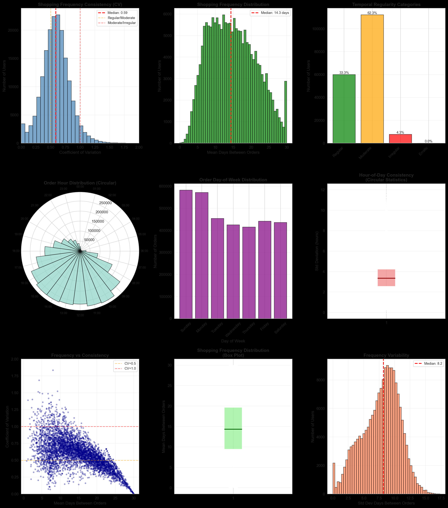
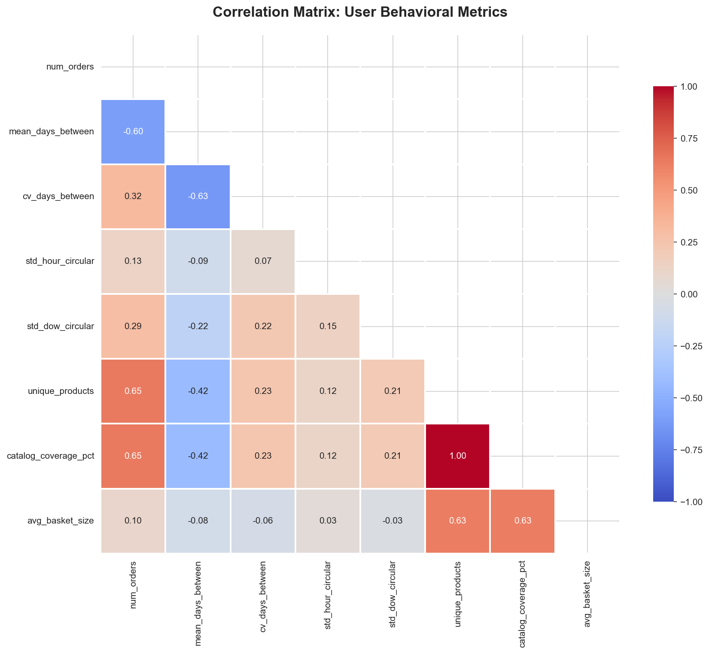
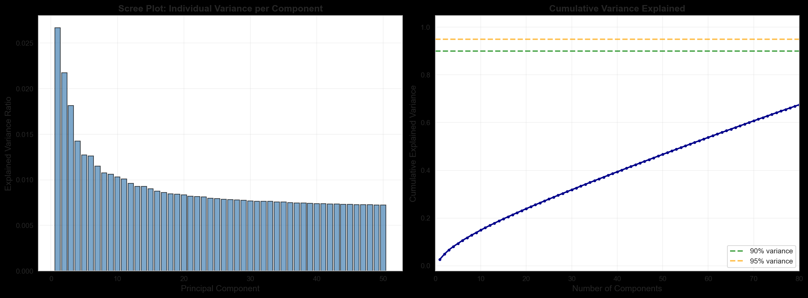
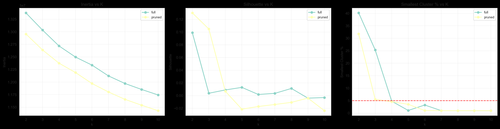
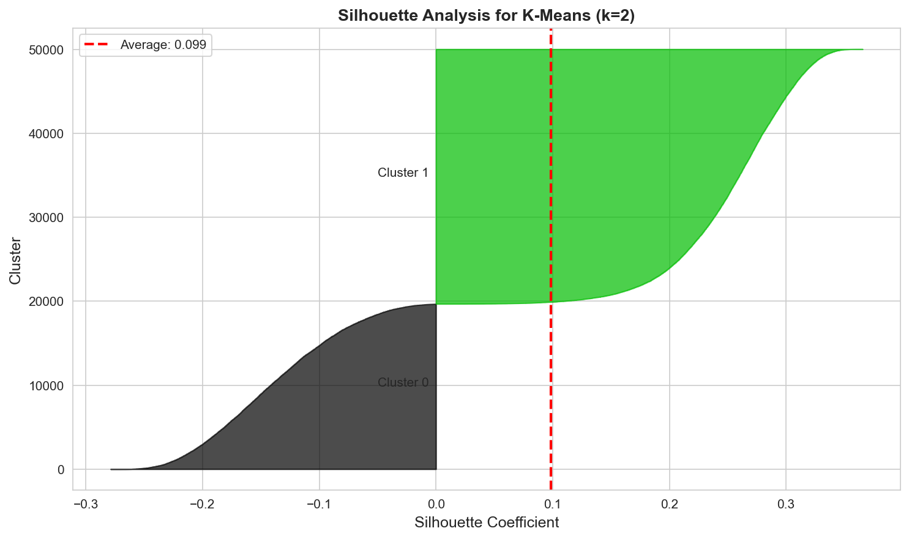
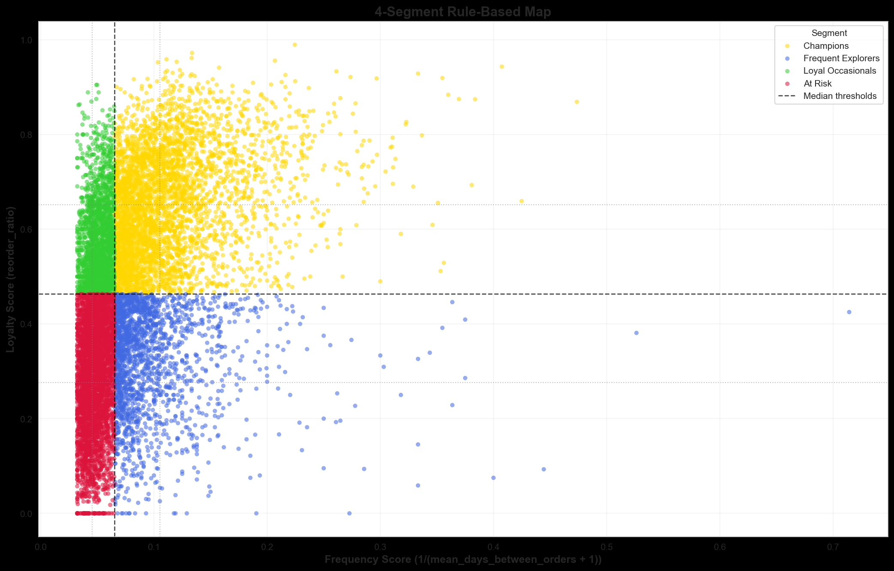
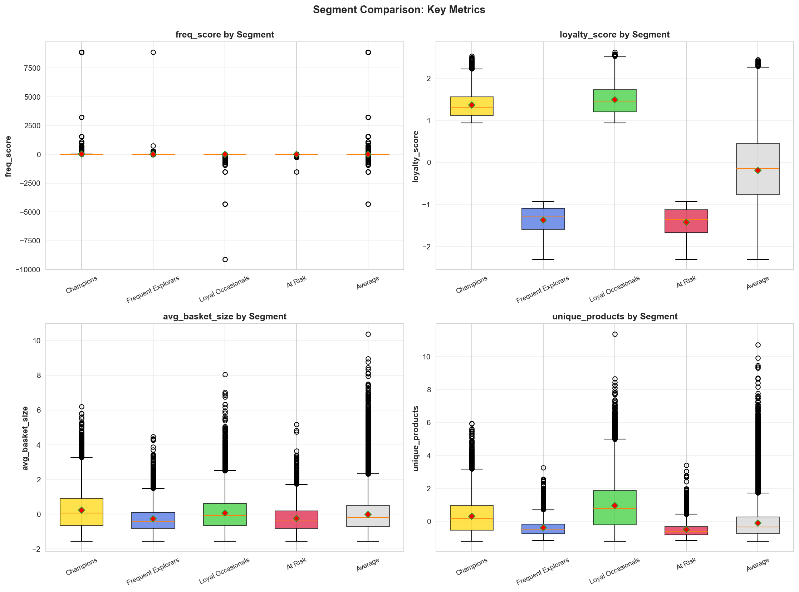

# Instacart Customer Segmentation

This project asks a practical product question:

**Can we segment users in a way that is both statistically defensible and operationally useful?**

Short answer: pure unsupervised clustering was not strong enough, so the final recommendation is a deterministic 4-segment rule-based framework.

## Visual Highlights

### 1) Data Readiness Checks

This distribution checks whether users have enough purchase history to support segmentation. The key signal is coverage: we want enough repeat behavior per user so downstream features are not mostly noise.

This plot tests whether behavior is stable enough over time to treat segments as meaningful patterns instead of short-lived spikes.

### 2) Feature Space and Reduction

Correlation review helps catch redundancy early. Highly overlapping features can inflate complexity without improving segmentation quality.

The PCA curve shows how much variance is retained as components increase. This was used to decide whether dimensionality reduction improved signal-to-noise before clustering.

### 3) Clustering Diagnostics

This optimization view compares candidate `k` values with objective metrics. It helps avoid arbitrary cluster-count choices.

Silhouette analysis quantifies separation quality. In this project, scores stayed moderate/weak, which is why clustering was kept as exploratory evidence rather than final assignment logic.

### 4) Final Production Segmentation

This is the final deterministic segmentation framework used for production-style assignment. Every user is mapped to one clear segment.

Segment distribution acts as a sanity check for operational use: no collapsed segment, no extreme imbalance, and full user coverage.

## If You’re Reviewing This Project

Start here for the quickest full-picture read:

- One-page overview: `EXEC_SUMMARY.md`
- End-to-end review path: `docs/00_canonical_case_story.md`
- Final recommendation and evidence: `docs/01_decision_memo.md`
- Segment actions by audience: `docs/02_segment_action_playbook.md`
- Validation experiment design: `docs/03_experiment_plan.md`
- Monitoring and recalibration plan: `docs/04_monitoring_and_retraining_plan.md`

## Project Snapshot

- Users: **182,223**
- Engineered features: **149**
- Best clustering result: **silhouette = 0.191** (`06_clustering_ablation_behavioral_features.ipynb`, `k=2`)
- Production segmentation design: **4-way rule-based segmentation** (full coverage)

## Notebook Flow

Core storyline:

1. `01_data_readiness_assessment.ipynb`
- Checks whether the data is suitable for segmentation (history depth, sparsity, stability).

2. `02_user_feature_engineering.ipynb`
- Builds user-level features (frequency, loyalty, basket behavior, diversity, aisle preferences).

3. `03_feature_preprocessing_and_reduction.ipynb`
- Prepares clustering-ready matrices and dimensionality-reduction variants.

4. `07_rule_based_segmentation.ipynb`
- Final rule-based 4-segment framework for production use.

Appendix diagnostics:

5. `04_clustering_baseline_validation.ipynb`
- Baseline clustering validation and algorithm comparison.

6. `05_clustering_ablation_all_features.ipynb`
- Ablation: all-feature clustering (performed poorly).

7. `06_clustering_ablation_behavioral_features.ipynb`
- Ablation: non-aisle/behavioral clustering (best unsupervised result).

## What Worked vs What Didn’t

### Unsupervised clustering

- Baseline PCA+behavioral matrix: weak separation.
- All-feature clustering (149 features): degraded quality.
- Non-aisle behavioral clustering improved to silhouette ~`0.19`, but still moderate/weak for hard persona boundaries.

Conclusion: clustering is useful as exploratory evidence, not ideal as final assignment logic.

### Rule-based segmentation (final)

Notebook 07 assigns every user into one of:
- Champions
- Frequent Explorers
- Loyal Occasionals
- At Risk

Latest distribution (`data/segments/segment_summary_percentile.csv`):
- Champions: **61,317** (**33.65%**)
- Frequent Explorers: **30,055** (**16.49%**)
- Loyal Occasionals: **29,851** (**16.38%**)
- At Risk: **61,000** (**33.48%**)

## Validation Highlights

From `data/segments/anova_results.csv`:
- Strong separation on multiple metrics:
  - `cv_days_between_orders` (Large effect)
  - `unique_products` (Large effect)
  - `unique_aisles` (Medium effect)
- `mean_order_hour` is statistically significant but negligible in practical effect.
- `mean_days_between_orders` is reported with a caveat in Notebook 07 because it is algebraically tied to `freq_score` used in assignment.

From split-stability diagnostics in Notebook 07:
- Segment profile metrics remain consistent across user splits (very small relative gaps).

## Why This Is Portfolio-Relevant

This repo demonstrates method selection under imperfect data:
- tested multiple unsupervised routes,
- quantified tradeoffs,
- avoided overclaiming,
- shipped a segmentation approach that is simple to explain and deploy.

## How To Run

1. Create a virtual environment (Python 3.9 recommended).
2. Install dependencies:
   - `pip install -r requirements.txt`
3. Run notebooks in order (`01` -> `07`).
4. Check outputs in:
   - `data/clusters/`
   - `data/segments/`

## Next Improvements

- Add true out-of-time validation with time-sliced feature construction.
- Add segment assignment script for batch scoring of new users.
- Add a lightweight stakeholder dashboard for segment KPIs and movement over time.
